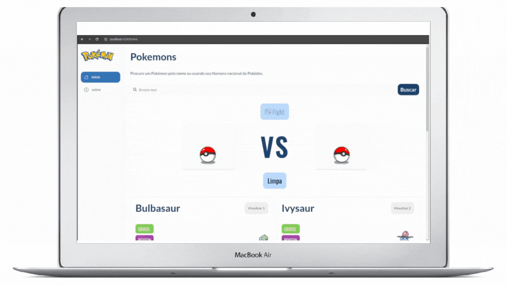
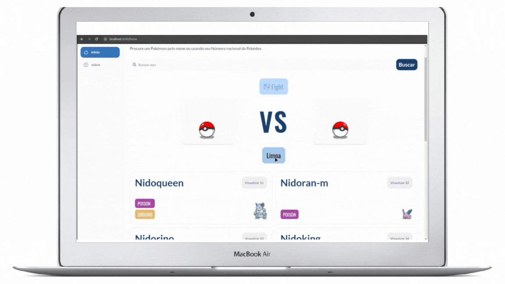

<h1 align="center">
    <strong> Desafio AEVO</strong>
</h1>

<p align="center">
    <apan align="center">
      
    </apan>
</p>

## 💻 Sobre o projeto

Desenvolvi uma aplicação web utilizando Angular para explorar os dados fornecidos pela PokeAPI. A aplicação apresenta os atributos estatísticos de um Pokémon de maneira semelhante a um card, proporcionando uma experiência visual envolvente. Este projeto foi concebido como parte do desafio de estágio em Desenvolvimento na AEVO.

## 💻 📱Web e Mobile
<p align="center">
    <apan align="center">
      
    </apan>
        <span align="center">
      
    </span>
</p>


## ⚙️ Funcionalidades

### Explorar a Documentação da API

- [Documentação da API](https://pokeapi.co/docs/v2):  Explore a documentação para detalhes de utilização.

### Campo de Busca e Exibir as informações(lista de pokemons) da requisição da API
  - A página possui um campo de busca que permite encontrar Pokémon pelo nome ou pelo ID. Quando o campo de busca é deixado em branco e o botão de busca é clicado, a lista de Pokémon anterior é exibida novamente.

### Visualizar informações detalhadas do pokemon
  - É possível visualizar os detalhes do Pokémon selecionado ao clicar no botão "Visualizar" no canto superior esquerdo do card do Pokémon. Você será redirecionado para a página de detalhes, onde encontrará informações detalhadas sobre o Pokémon selecionado.

### Battle fight 
  - A zona de batalha permite verificar qual dos dois Pokémon selecionados possui um stat total maior. Para adicionar um Pokémon à zona de batalha, clique duas vezes no card (para desktop) ou pressione/touch no card (para dispositivos móveis). Depois de selecionar os Pokémon, pressione o botão "Fight" e aguarde o resultado. No final, será mostrado o vencedor e seu stat total. Para uma nova batalha, limpe os campos pressionando o botão "Limpar".


## 🧪 Tecnologias

Esse projeto foi desenvolvido com as seguintes tecnologias:

- [HTML](https://developer.mozilla.org/pt-BR/docs/Web/HTML)
- [CSS](https://developer.mozilla.org/pt-BR/docs/Web/CSS)
- [Framework Angular](https://github.com/angular/angular-cli)
- [Typescript](https://www.typescriptlang.org/docs/)


## 🚀 Como executar

Execute o comanda baixo para um servidor de desenvolvimento. Depois navegue até `http://localhost:4200/`. O aplicativo será recarregado automaticamente se você alterar algum dos arquivos de origem.

```bash
# Clone do repositório
git https://github.com/erikbernard/challenge-AEVO.git

# Acesse a pasta do projeto no seu terminal/cmd
cd challenge-AEVO

# Instale as dependências via npm
npm install

# Run na aplicação
ng serve

# ou
npm run serve

```


## 🦸 Autor
Erik Bernardo
- [GitHub](https://github.com/erikbernard)
- [Email](mailto:erikbrsilva@gmail.com)
