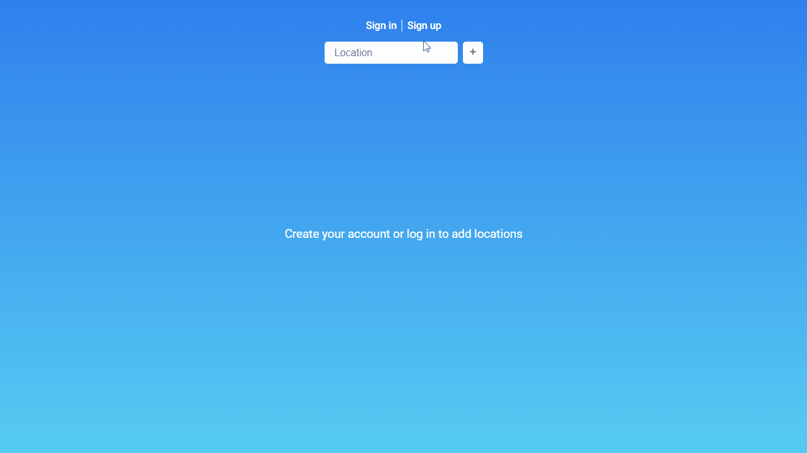

# Desafio Estágio em Desenvolvimento - AEVO


## Como executar o projeto
### Back-end
```bash
# Vá para a pasta backend
$ cd backend

# Duplique o arquivo .env
$ cp .env.example .env

# Altere a variável de ambiente
$ nano .env

# Instale as dependências
$ npm install

# Execute a aplicação
$ npm start
```

### Front-end
```bash
# Vá para a pasta frontend
$ cd frontend

# Duplique o arquivo .env
$ cp .env.example .env

# Altere a variável de ambiente
$ nano .env

# Instale as dependências
$ npm install

# Execute a aplicação
$ npm start
```

## Tecnologias
### Back-end ([JavaScript](https://www.javascript.com/) + [Node.js](https://nodejs.org/))
- [Bcrypt](https://github.com/kelektiv/node.bcrypt.js)
- [Cookie Parser](https://github.com/expressjs/cookie-parser)
- [CORS](https://github.com/expressjs/cors)
- [Dotenv](https://github.com/motdotla/dotenv)
- [Express](https://expressjs.com/)
- [JsonWebToken](https://github.com/auth0/node-jsonwebtoken)
- [Knex](http://knexjs.org/)
- [Nodemon](https://nodemon.io/)
- [SQLite3](https://github.com/mapbox/node-sqlite3)

### Front-end ([JavaScript](https://www.javascript.com/) + [React](https://reactjs.org/))
- [Axios](https://github.com/axios/axios)
- [React Cookie](https://github.com/reactivestack/cookies/tree/master/packages/react-cookie/)
- [React Icons](https://react-icons.github.io/react-icons/)
- [React Router DOM](https://reactrouter.com/)
- [React Toastify](https://fkhadra.github.io/react-toastify/)
- [Remove Accents](https://github.com/tyxla/remove-accents)
